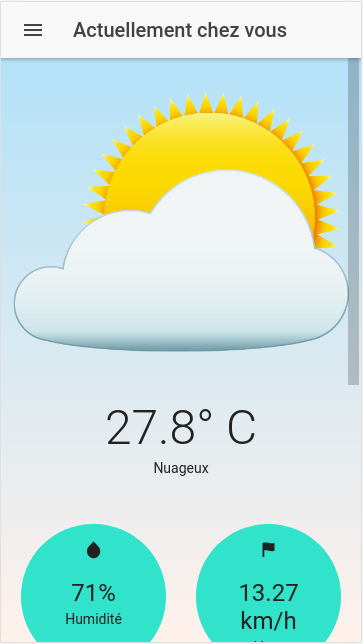
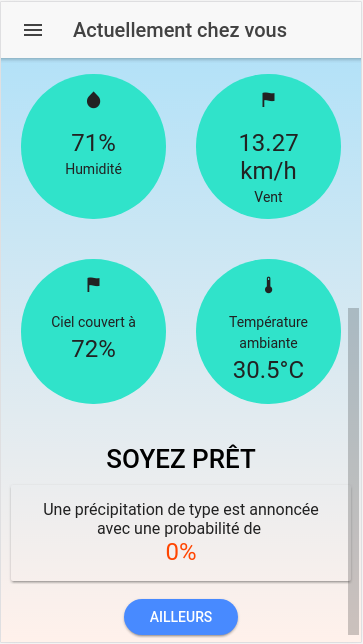

# Oweather

A mobile weather app witch shows the current forecast for user location. Even for another place

## Screenshots




## Functionalities 

- Show the forecast of user position
- Show forecast for the next week at the user position
- Show forecast for any capital in pre-filled list

### Prerequisites

Install Ionic. Tap the following command in terminal
```
npm install -g cordova ionic
```

Before installing ionic, make sure you have the latest version of [Nodejs](https://nodejs.org/)

## API Reference

[Dark Sky API](https://darksky.net/dev/) - The easiest, most advanced, weather API on the web.

## Built With

* [Ionic Framework](https://ionicframework.com) - The top open source framework for building amazing mobile apps. 